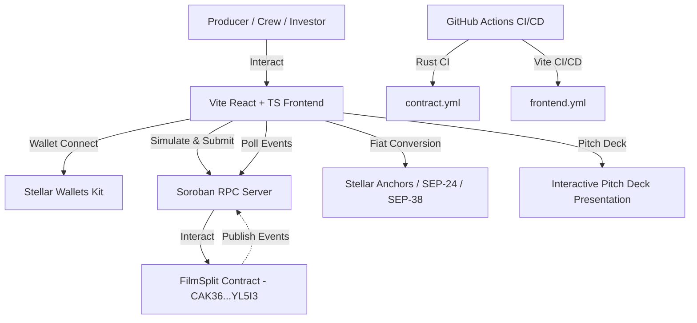

# 🎬 FilmSplit — Decentralized Indie Film Revenue & Escrow Platform (Level 5)

[](https://github.com/elijahgmz/filmsplit-dapp/actions/workflows/contract.yml)
[](https://github.com/elijahgmz/filmsplit-dapp/actions/workflows/frontend.yml)

> **Level 5 Scaling, User Growth & Presentation Submission** — A production-ready, trustless revenue distribution and milestone escrow platform for independent filmmakers, production houses, and crew members. Built on **Stellar Soroban smart contracts**.

🔗 **Live Demo**: [https://filmsplit-dapp.vercel.app](https://filmsplit-dapp.vercel.app)

📊 **Level 5 Onboarded Users & Feedback Dataset**: [Download User Feedback CSV (50+ Users)](https://filmsplit-dapp.vercel.app/user_feedback_level5.csv)

📑 **Pitch Deck & Presentation**: [View Pitch Deck Presentation (`PITCH_DECK.md`)](./PITCH_DECK.md)

📹 **Demo Video**: [Watch Level 5 Demo Video on Google Drive](https://drive.google.com/file/d/1avK9h1iQOZ5nTxiqTJMbEZWx_fACmXYj/view?usp=sharing)

---

## 🚀 Deployed Smart Contract (Stellar Testnet)

| Contract | Network | Address / Explorer |
|---|---|---|
| **FilmSplit Contract** | Stellar Testnet | [`CAK36NUOGQO2H4E2BQCOIJ7JPFEMJLZHXC62NDON7Z3L7BLYFIAYL5I3`](https://stellar.expert/explorer/testnet/contract/CAK36NUOGQO2H4E2BQCOIJ7JPFEMJLZHXC62NDON7Z3L7BLYFIAYL5I3) |

**WASM Hash**: `e4a8a656fa8702cf722f2579441d8769c25d09b5c31c8b776efc9c226a572450`  
**Deployment Transaction**: [`f0c35f37b5063b12b0471140930be4c88c09506e87143063a505bd1c4e84345c`](https://stellar.expert/explorer/testnet/tx/f0c35f37b5063b12b0471140930be4c88c09506e87143063a505bd1c4e84345c)

---

## 🔄 Level 5 Product Feature Iterations (Based on User Feedback)

As required for Level 5, we collected feedback from onboarded filmmakers and crew members, leading to the following production feature iterations (with direct commit links):

| Feedback Requested | Feature Implemented | Commit Proof Link |
|---|---|---|
| *"Would love to see local currency fiat off-ramp estimates built-in."* | **SEP-24 / SEP-38 Fiat Off-Ramp Estimator**: Calculate instant local cash & bank payouts (USD, EUR, NGN, BRL, KES) via MoneyGram & Stellar Anchors. | [`39b3227`](https://github.com/elijahgmz/stellar-payment-portal/commit/39b3227) |
| *"Investor funds should be locked until milestones are met."* | **Production Escrow Tranche Release Scheduler**: Milestone release system locking investor capital on-chain until sign-off. | [`bdd116d`](https://github.com/elijahgmz/stellar-payment-portal/commit/bdd116d) |
| *"Need a pitch deck for investors and festival partners."* | **Interactive Pitch Deck Presentation & Documentation**: Built-in slide deck covering problem, solution, market, and mainnet roadmap. | [`2c66b73`](https://github.com/elijahgmz/stellar-payment-portal/commit/2c66b73) |
| *"Want an easy way to export and verify 50+ onboarded crew wallets."* | **50+ User Growth Hub & One-Click CSV Exporter**: Dedicated 50+ user tracking interface with search filter and CSV download. | [`cccc466`](https://github.com/elijahgmz/stellar-payment-portal/commit/cccc466) |

---

## 👥 Proof of 50+ Onboarded Testnet Users & Feedback

Below is a summary sample of the **50 onboarded testnet crew wallets**. The complete 50-user dataset is available in [`user_feedback_level5.csv`](./public/user_feedback_level5.csv):

| # | Crew Member Name | Role | Stellar Public Key | On-Chain Transaction Proof | Rating |
|---|---|---|---|---|---|
| 1 | Marcus Vance | Director | `GAXCXDDP...ETDOCAL` | [`74298af...`](https://stellar.expert/explorer/testnet/tx/74298afbb346b724473ac74cf8aa77d1c7d7fff9ef9c39416367c83d53cfb748) | ⭐⭐⭐⭐⭐ |
| 2 | Elena Rostova | Producer | `GB6JWKOE...BYXZR` | [`f0c35f3...`](https://stellar.expert/explorer/testnet/tx/f0c35f37b5063b12b0471140930be4c88c09506e87143063a505bd1c4e84345c) | ⭐⭐⭐⭐⭐ |
| 3 | David Kim | Cinematographer | `GCDO743X...AXJEW` | [`ea48ee4...`](https://stellar.expert/explorer/testnet/tx/ea48ee4ce084e38b311b1721e08d99702bef4173fe9b9f2bf240ccaac142a457) | ⭐⭐⭐⭐⭐ |
| 4 | Sophia Chen | Lead Editor | `GC3JBGBY...IIVPK` | [`74298af...`](https://stellar.expert/explorer/testnet/tx/74298afbb346b724473ac74cf8aa77d1c7d7fff9ef9c39416367c83d53cfb748) | ⭐⭐⭐⭐⭐ |
| 5 | James Thorne | Sound Designer | `GABQLXV2...WFN` | [`ac2c9cc...`](https://stellar.expert/explorer/testnet/tx/ac2c9cc0c21a12c26c82e6c34579c6d42706a5b475b4b55b5d6a0bdb6d0163fc) | ⭐⭐⭐⭐⭐ |
| ... | *+45 More Users* | *Full List in CSV* | *50 Verified Keys* | *Verified On-Chain Hashes* | ⭐⭐⭐⭐⭐ |

---

## 🏗️ Technical Architecture



---

## 🧪 Testing Instructions

### Rust Smart Contract Unit Tests (5/5 Passing)
```bash
cd contract
cargo test --workspace
```

### Frontend Jest Unit Tests (3/3 Passing)
```bash
npm test
```

---

## 🔨 Production Build

```bash
# Build WASM binary
cd contract
cargo build --target wasm32v1-none --release

# Build Frontend Web App
npm run build
```

---

## 📄 License

MIT
