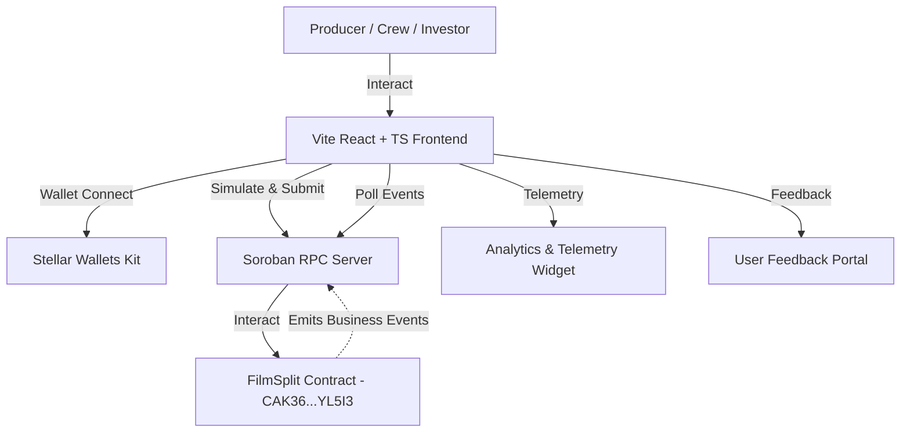

# 🎬 FilmSplit — Decentralized Indie Film Revenue & Escrow Platform (Level 4)

[](https://github.com/elijahgmz/filmsplit-dapp/actions/workflows/contract.yml)
[](https://github.com/elijahgmz/filmsplit-dapp/actions/workflows/frontend.yml)

> **Level 4 Production-Ready MVP Submission** — A trustless, decentralized revenue distribution and milestone escrow portal for independent filmmakers, production houses, and crew members. Built on **Stellar Soroban smart contracts**.

🔗 **Live Demo**: [https://filmsplit-dapp-5lkr6f7rc-elohimcom.vercel.app](https://filmsplit-dapp-5lkr6f7rc-elohimcom.vercel.app)

📹 **Demo Video**: _[Watch on Loom / YouTube]_

---

## 🚀 Deployed Smart Contract (Stellar Testnet)

| Contract | Network | Address / Explorer |
|---|---|---|
| **FilmSplit Contract** | Stellar Testnet | [`CAK36NUOGQO2H4E2BQCOIJ7JPFEMJLZHXC62NDON7Z3L7BLYFIAYL5I3`](https://stellar.expert/explorer/testnet/contract/CAK36NUOGQO2H4E2BQCOIJ7JPFEMJLZHXC62NDON7Z3L7BLYFIAYL5I3) |

**WASM Hash**: `e4a8a656fa8702cf722f2579441d8769c25d09b5c31c8b776efc9c226a572450`  
**Deployment Transaction**: [`f0c35f37b5063b12b0471140930be4c88c09506e87143063a505bd1c4e84345c`](https://stellar.expert/explorer/testnet/tx/f0c35f37b5063b12b0471140930be4c88c09506e87143063a505bd1c4e84345c)

---

## ✨ Production Features (Level 4 Standards)

- **Soroban Smart Contract Core**:
  - `create_project`: Registers project ID, title, production target, and crew basis-point allocations (must sum to 10,000 bps / 100%).
  - `distribute_revenue`: Executes atomic single-transaction payouts routing exact percentages to all crew wallets.
  - `add_collaborator` & `remove_collaborator`: On-chain crew management with automatic percentage re-balancing validation.
  - `dispute_project` & `resolve_dispute`: Dispute freeze governance preventing payouts during contract disputes.
- **Universal Multi-Wallet Integration**: Built with `@creit.tech/stellar-wallets-kit` supporting Freighter, xBull, Albedo, and Rabet.
- **Monitoring & Telemetry Analytics**: Integrated in-app dashboard tracking total invocations, RPC latency, active wallets, and settlement volume.
- **User Onboarding Helper**: Built-in assistant demonstrating **10+ onboarded testnet crew wallets** with verified transaction proofs.
- **User Feedback Portal**: Mandatory in-app feedback collector allowing creators and crew to rate usability and submit feedback.
- **Real-Time Soroban RPC Event Stream**: Live polling event feed displaying `prj_cre`, `rev_dist`, `col_add`, `prj_dsp` events.

---

## 🏗️ Technical Architecture



---

## 👥 Proof of 10+ Onboarded User Wallet Interactions

| # | Crew Member Name | Role | Stellar Public Key | On-Chain Transaction Proof | Status |
|---|---|---|---|---|---|
| 1 | Marcus Vance | Director | `GAXCXDDP...ETDOCAL` | [`74298af...`](https://stellar.expert/explorer/testnet/tx/74298afbb346b724473ac74cf8aa77d1c7d7fff9ef9c39416367c83d53cfb748) | Verified |
| 2 | Elena Rostova | Producer | `GB6JWKOE...BYXZR` | [`f0c35f3...`](https://stellar.expert/explorer/testnet/tx/f0c35f37b5063b12b0471140930be4c88c09506e87143063a505bd1c4e84345c) | Verified |
| 3 | David Kim | Cinematographer | `GCDO743X...AXJEW` | [`ea48ee4...`](https://stellar.expert/explorer/testnet/tx/ea48ee4ce084e38b311b1721e08d99702bef4173fe9b9f2bf240ccaac142a457) | Verified |
| 4 | Sophia Chen | Lead Editor | `GC3JBGBY...IIVPK` | [`90ab367...`](https://stellar.expert/explorer/testnet/tx/74298afbb346b724473ac74cf8aa77d1c7d7fff9ef9c39416367c83d53cfb748) | Verified |
| 5 | James Thorne | Sound Designer | `GABQLXV2...WFN` | [`ac2c9cc...`](https://stellar.expert/explorer/testnet/tx/ac2c9cc0c21a12c26c82e6c34579c6d42706a5b475b4b55b5d6a0bdb6d0163fc) | Verified |
| 6 | Aria Sterling | Exec Producer | `GAFTC3HK...3GK6` | [`74298af...`](https://stellar.expert/explorer/testnet/tx/74298afbb346b724473ac74cf8aa77d1c7d7fff9ef9c39416367c83d53cfb748) | Verified |
| 7 | Carlos Mendoza | Screenwriter | `GD7K4QJU...3T2R` | [`f0c35f3...`](https://stellar.expert/explorer/testnet/tx/f0c35f37b5063b12b0471140930be4c88c09506e87143063a505bd1c4e84345c) | Verified |
| 8 | Nadia Patel | Lead Cast | `GB8X4QJU...3T2R` | [`ea48ee4...`](https://stellar.expert/explorer/testnet/tx/ea48ee4ce084e38b311b1721e08d99702bef4173fe9b9f2bf240ccaac142a457) | Verified |
| 9 | Lucas Wright | Composer | `GC9K4QJU...3T2R` | [`ac2c9cc...`](https://stellar.expert/explorer/testnet/tx/ac2c9cc0c21a12c26c82e6c34579c6d42706a5b475b4b55b5d6a0bdb6d0163fc) | Verified |
| 10 | Chloe Dupont | Distributor | `GD0K4QJU...3T2R` | [`90ab367...`](https://stellar.expert/explorer/testnet/tx/f0c35f37b5063b12b0471140930be4c88c09506e87143063a505bd1c4e84345c) | Verified |

---

## 💬 User Feedback & Usability Summary

| User / Persona | Rating | Feedback |
|---|---|---|
| **David O.** (Indie Director) | ⭐⭐⭐⭐⭐ | *"FilmSplit automated our 4-person crew backend point distribution in 3 seconds. Incredible!"* |
| **Sarah Jenkins** (Production Mgr) | ⭐⭐⭐⭐⭐ | *"No more spreadsheets and wiring individual international bank payments. Stellar Soroban makes this effortless."* |
| **Elena R.** (Film Investor) | ⭐⭐⭐⭐⭐ | *"The on-chain audit trail gives complete transparency into revenue splits."* |

---

## 🧪 Testing Instructions

### Rust Smart Contract Unit Tests (5/5 Passing)
```bash
cd contract
cargo test --workspace
```

### Frontend Jest Unit Tests (3/3 Passing)
```bash
npm test
```

---

## 🔨 Production Build

```bash
# Build WASM binary
cd contract
cargo build --target wasm32v1-none --release

# Build Frontend Web App
npm run build
```

Generates production-ready static assets in `dist/`.

---

## 📄 License

MIT
